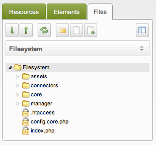

## Introduction

This tutorial will show you how to create a second media source that you can use for clients that will hide your MODX site files. This tutorial should be performed on sites before your clients have uploaded any files. If you are doing this on an existing site, please read Troubleshooting: Existing Installs at the end of this article.

Let's get to it! By default, your file manager should look something like this:

That's cool and all, but we can probably make it more meaningful by preventing users from viewing files they will never use. Let's make it look something like this:

## Tutorial

### Step 1: Create a Directory Structure

Great. Let's make a folder in /assets/ called "files". Inside that, two more, one called "pdf" and the other "images". All of the files that our clients upload will go into these folders. Let's CHMOD the three folders we've created to 777. Your filesystem media source should look like this:

### Step 2: Hide the Filesystem Media Source

Now it's time to hide everything above the "/assets/files/" folder.

1. Go to Tools > Media Sources.
2. Right click on the Filesystem Media Source and select "Update Media Source".
3. Go to the Access Permissions tab.
4. Click "Add User Group"
5. Select "Administrator" as the user group, "Member" as the minimum role, and "Media Source Admin" as the policy. This will mean that all users in the Administrator user group will be able to add / remove media sources. You want to ensure that your clients are in a different user group. If they are in the admin user group, you can set the minimum role for this media source to "Super User" so that only users with a role of "Super User" can access the media source.
6. Click "Done", and then "Save".

At this point, if a client logs in, they will not be able to use the file system at all. Let's fix that.

### Step 3: Add the Client Files Media Source

Now we're going to create a new media source that our clients will use.

1. Go to Tools > Media Sources
2. Click "Create New Media Source"
3. Scroll down and put "assets/files/" as both the basePath and baseURL values. The first tells MODX where on the server to look, and the second tells MODX where on the web to look (i.e., relative to your domain name). Let's keep both of the next two keys (basePathRelative and baseUrlRelative) set to "true" for now. For more advanced setups (such as a site that uses different domains for different contexts) you may need to set absolute paths. Don't worry about it for now.
4. Click "Save"

At this point, clients can log in, but it's kind of confusing how they use the file system. When they go to the files tab, the default media source is one that they don't have access to. They can still change the media source to theirs, but it's a pretty confusing experience for the user. Yikes. Let's fix that.

### Step 4: Set the Default Media Source

It's easy to set the default media source.

1. System > System Settings
2. Click "Filter by area" and select "Back-end Manager"
3. Find the "Default Media Source" setting. Change this from "Filesystem" to "Client Files"
4. Wait for MODX to save this setting

At this point, when clients log in, they will see "Client Files" as the default media source and be able to use it as normal. Any new Template Variables of the Image or File variety will also reference this location.

We're done!

## Troubleshooting: Existing Installs

If you are using this tutorial on a site that already has TVs in place and images uploaded, you will need to update their paths after you have performed Steps 1-4:

1. Move all the files from the server location to the new location. Their location should be the same path relative to the media source location
2. Update all of the template variables to reference the new media source

That should be it!

## Advanced Usage

### Different Contexts

It's easy to set up a different media source for each context. For each context, create a new setting called "default\_media\_source" and fill in the ID of the media source.

Any new TVs in that context will now use that media source.

 

Combined with [this tutorial](building-sites/contexts/virtual-host "Creating a Subdomain from a Folder using Virtual Hosts"), we now have different sites on the same MODX install, each with their own unique file system. Neat!
