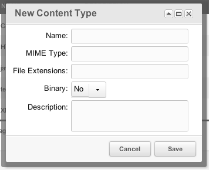

## What are Content Types?

Content types are specific filesystem types for your resources. They are associated with file extensions and tell the MODX Parser what type of extension to render the page with.

For example, a [Resources](building-sites/resources "Resources") with an alias of 'test' and Content Type "CSS" that has a file extension of ".css" will render as:

> test.css

instead of test.html. This allows you to create any type of file from [Resources](building-sites/resources "Resources").

## Usage

When editing a Resource, simply select the Content Type that you'd like to use:

Then save the [Resources](building-sites/resources "Resources"). This will automatically associate that [Resources](building-sites/resources "Resources") with the selected Content Type.

### Creating New Content Types

First, go to System -> Content Types. You'll see a grid populated with all the current Content Types. Click on 'New Content Type', and a window will appear:

The fields that appear are as follows:

- **Name** - This is the name of the Content Type. It is mainly for organizational and labeling purposes, and does not affect the function of the type.
- **MIME Type** - Here you can set the MIME Type for the extension, which will tell the browser what type of file the [Resources](building-sites/resources "Resources") is. A list of available MIME Types can be found [here](http://www.iana.org/assignments/media-types/) or [here](http://www.feedforall.com/mime-types.htm).
- **File Extensions** - This is the file extension to render the Resource as. Include the dot, e.g. ".doc"
- **Binary** - Is the file type text/ascii or binary?
- **Description** - An optional field for your own descriptive purposes.

From there, click "save" and the Content Type will appear in the grid.

**About Aliases**
When you create resources, the File Extension you choose for your content type will be what's appended to the alias of that resource (if you have friendly URLs enabled)

## See Also

- [Resources](building-sites/resources "Resources")