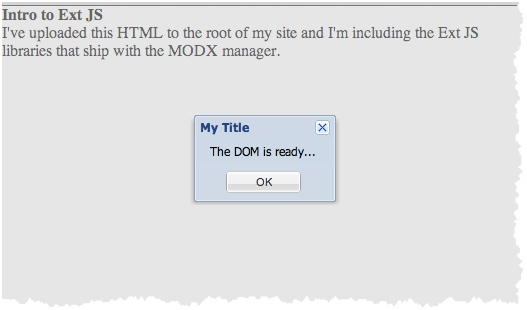
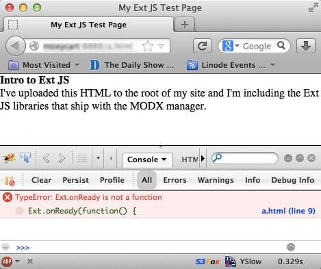
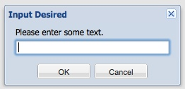
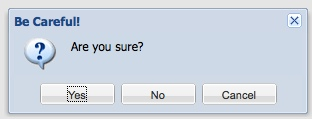
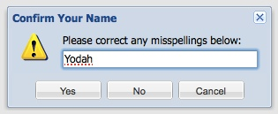

## Your First Ext JS Script

MODX ships with Ext JS (technically, it ships with MODExt, its own flavor of Ext JS, but it's close enough for beginners). Our first task is to create an HTML page that loads the necessary Ext JS components. This boils down to 3 components:

- Styles (CSS)
- Base JS
- All JS

For this example, create a file at the root of your MODX site, named "a.html", and reference the Ext JS components that come included in the MODX manager (you may need to change your manager URL if you've customized the manager path).

``` html
<html>
    <title>My Ext JS Test Page</title>
    <link  rel="stylesheet" type="text/css" href="manager/assets/ext3/resources/css/ext-all.css" />
    <script type="text/javascript" src="manager/assets/ext3/adapter/ext/ext-base.js"></script>
    <script type="text/javascript" src="manager/assets/ext3/ext-all.js"></script>
    <script type="text/javascript">
        Ext.onReady(function() {
            Ext.MessageBox.alert('My Title','The DOM is ready...');
        });
    </script>
    <body>
        <h1>Intro to Ext JS</h1>
        <p>I've uploaded this HTML to the root of my site and I'm including the Ext JS libraries that ship with the MODX manager.</p>
    </body>
</html>
```

Or if you want to call the alert more verbosely, you might want to set variables for the title and message:

``` javascript
Ext.onReady(function() {
    var title = 'My Title';
    var msg = 'The DOM is ready...';
    Ext.MessageBox.alert(title,msg);
});
```

Either way, the result is the same: when you navigate to this page in a browser, you should get a pop-up window like the one pictured. This test is a tip of the hat to the built-in Javascript alert function and it is a simple way to test for JS functionality.



Congratulations! You have written your first script in MODExt!

### Debugging

If you have any problems with this basic test, try installing the [Firebug](http://getfirebug.com/) plugin inside the Firefox browser. Its console view will print out Javascript errors. Although they are not as precise as PHP errors, being able to see Javascript errors is _hugely_ valuable and it goes a long way in helping you track down what's wrong.



## Prompting

The MessageBox object isn't a one-trick pony: you can use it to do some more advanced things than just popping alerts. You can also prompt the user for input using the prompt method. It will automatically print an "OK" and a "Cancel" button for you.

Once you prompt a user for input, you'll need a callback function to do something with it. Let's build something like this:

``` javascript
<script type="text/javascript">
Ext.onReady(function() {
    var title = 'Input Desired';
    var msg = 'Please enter some text.';
    var myCallback = function(btn, text) {
        console.info('You pressed ' + btn);
        if (text) {
            console.info('You entered '+ text);
        }
    }
    Ext.MessageBox.prompt(title,msg,myCallback);
});
</script>
```

We're using a lambda function for **myCallback**, and that might be weird for some of you. You could get the same effect doing it this way:

``` javascript
<script type="text/javascript">
function myCallback(btn, text) {
    console.info('You pressed ' + btn);
    if (text) {
        console.info('You entered '+ text);
    }
}

Ext.onReady(function() {
    var title = 'Input Desired';
    var msg = 'Please enter some text.';
    Ext.MessageBox.prompt(title,msg,myCallback);
});
</script>
```

The result should look like this:



This is a good time to reinforce the Firebug debugger. Using **console.log** or **console.info** prints to the Firebug console. When you activate Firebug and you view the console tab (it's active by default), you can see the output of your calls to the console methods:


You can see from the picture that the `btn` variable comes through as either `ok` or `cancel` (lowercase). So you could write logic in your callback function to work with those results.

## A Better Message Box

There's a lot of stuff you can do with the humble message box. Here's an example to give you an idea of the various properties that are available.

``` html
<script type="text/javascript">
Ext.onReady(function() {
    var myCallback = function(btn, text) {
        console.info('You pressed ' + btn);
        if (text) {
            console.info('You entered '+ text);
        }
    }
    Ext.MessageBox.show({
        title : 'Be Careful!',
        msg : 'Are you sure?',
        width : 300,
        buttons : Ext.MessageBox.YESNOCANCEL,
        fn : myCallback,
        icon : Ext.MessageBox.QUESTION
    });
});
</script>
```



So notice the "icon" and the "buttons" attributes.

### Icons

You can take advantage of the following constants as an argument for the **Ext.MessageBox.show()** "icon" attribute:

- Ext.MessageBox.INFO
- Ext.MessageBox.ERROR
- Ext.MessageBox.QUESTION
- Ext.MessageBox.WARNING

### Buttons

You can take advantage of the following constants as an argument for the **Ext.MessageBox.show()** "buttons" attribute:

- Ext.MessageBox.OK
- Ext.MessageBox.CANCEL
- Ext.MessageBox.OKCANCEL
- Ext.MessageBox.YESNO
- Ext.MessageBox.YESNOCANCEL

**Less is More**
**Ext.Msg** is a shorthand notation for **Ext.MessageBox**

## A Better Prompt

The **Ext.MessageBox.show()** method is your ticket to mastering message boxes (or its shorthand equivalent **Ext.Msg**), but it may not be immediately obvious how to make it prompt the user. The trick there is to use the **multiline** attribute.

``` html
<script type="text/javascript">
Ext.onReady(function() {
    var myCallback = function(btn, text) {
        console.info('You pressed ' + btn);
        if (text) {
            console.info('You entered '+ text);
        }
    }
    Ext.MessageBox.show({
        title : 'Confirm Your Name',
        msg : 'Please correct any misspellings below:',
        width : 300,
        multiline: 20,
        value : 'Yodah',
        buttons : Ext.MessageBox.YESNOCANCEL,
        fn : myCallback,
        icon : Ext.MessageBox.WARNING
    });});
</script>
```



The value of 20 here represents the height in pixels. You can also set it simply to "true" and end up with a small textarea. The "value" attribute is what specifies the text that appears inside the input.

See the official docs for more info: <http://docs.sencha.com/extjs/3.4.0/#!/api/Ext.MessageBox>

1. [Ext JS Tutorial - Message Boxes](extending-modx/custom-manager-pages/modext/modext-tutorials/1.-ext-js-tutorial-message-boxes)
2. [Ext JS Tutorial - Ajax Include](extending-modx/custom-manager-pages/modext/modext-tutorials/2.-ext-js-tutorial-ajax-include)
3. [Ext JS Tutorial - Animation](extending-modx/custom-manager-pages/modext/modext-tutorials/3.-ext-js-tutorial-animation)
4. [Ext JS Tutorial - Manipulating Nodes](extending-modx/custom-manager-pages/modext/modext-tutorials/4.-ext-js-tutorial-manipulating-nodes)
5. [Ext JS Tutorial - Panels](extending-modx/custom-manager-pages/modext/modext-tutorials/5.-ext-js-tutorial-panels)
6. [Ext JS Tutoral - Advanced Grid](extending-modx/custom-manager-pages/modext/modext-tutorials/7.-ext-js-tutoral-advanced-grid)
7. [Ext JS Tutorial - Inside a CMP](extending-modx/custom-manager-pages/modext/modext-tutorials/8.-ext-js-tutorial-inside-a-cmp)
