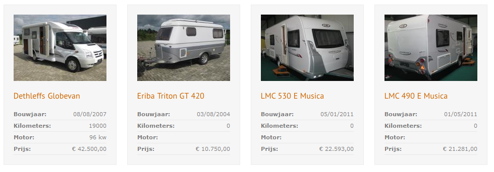
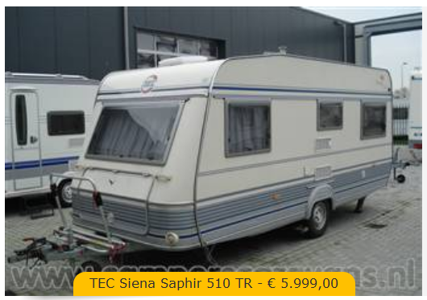

cmCampers can be used to aggregate data on the different vehicles in the database.

## Snippet Properties

You can use the following properties in cmCampers to adjust its behaviour and to make it your own. Some of them overlap with the cmCamperDetails snippet.

| &property      | Description                                                                                                                                                                                                                                                                                     | Default Value                                                                                                           |
| -------------- | ----------------------------------------------------------------------------------------------------------------------------------------------------------------------------------------------------------------------------------------------------------------------------------------------- | ----------------------------------------------------------------------------------------------------------------------- |
| start          | Possible offset to ignore the first N vehicles.                                                                                                                                                                                                                                                 | 0                                                                                                                       |
| limit          | Number of results to return from the snippet. Set to 0 or a real high number for infinite.                                                                                                                                                                                                      | 4                                                                                                                       |
| sort           | Field to sort on. Accepts any field in the cmCamper object but not all of them would make sense. Note that when sorting on related items (Brand, Owner) it will sort on their ID and \*not\* the name. When searchFromRequest is set to 1 the sort can be determined by the sort url parameter. | added                                                                                                                   |
| dir            | asc                                                                                                                                                                                                                                                                                             | desc. Direction to sort on. When searchFromRequest is set to 1 the sort can be determined by the sortdir url parameter. | desc |
| includeBrand   | 1                                                                                                                                                                                                                                                                                               | 0. Determines if the related brand object should be retrieved. Can save some processing time when not needed.           | 1    |
| includeOwner   | 1                                                                                                                                                                                                                                                                                               | 0. Determines if the related owner object should be retrieved. Can save some processing time when not needed.           | 0    |
| includeImages  | 1                                                                                                                                                                                                                                                                                               | 0. Determines if the related images should be retrieved. Can save some processing time when not needed.                 | 1    |
| includeOptions | 1                                                                                                                                                                                                                                                                                               | 0. Determines if the related options should be retrieved. Can save some processing time when not needed.                | 1    |
| status         | Comma seperated list of status IDs that should be included in the results. The IDs are:                                                                                                                                                                                                         |

1. Unconfirmed
2. Active
3. Favorite
4. Conditionally sold
5. Sold
6. Inactive | 1,2,3,4 |
| numimages | Integer indicating how many images should be retrieved. | 1 |
| target | Integer resource ID for the camper details page. Will be used with makeUrl to create a link following friendly url settings, passing "cid" in the URL with the camper ID. | 2 |
| tplOuter | Chunkname. Outer template to wrap the entire result set. [Placeholders](extras/campermanagement/campermanagement.developing-the-front-end/placeholders-you-can-use "CamperManagement.Placeholders you can use") | cmDefaultTplOuter |
| tplItem | Chunkname. Template for one item. \[Placeholders|display/ADDON/CamperManagement.Placeholders+you+can+use\] | cmDefaultTplItem |
| tplImageOuter | Chunkname. Outer template to wrap the entire image result set, called for every vehicle item. \[Placeholders|display/ADDON/CamperManagement.Placeholders+you+can+use\] | cmDefaultTplImageOuter |
| tplImageItem | Chunkname. Template for one image item. \[Placeholders|display/ADDON/CamperManagement.Placeholders+you+can+use\] | cmDefaultTplImageItem |
| tplOptionsOuter | Chunkname. Outer template to wrap the entire options result set, called for every vehicle item. \[Placeholders|display/ADDON/CamperManagement.Placeholders+you+can+use\] | cmDefaultTplOptionsOuter |
| tplOptionsItem | Chunkname. Template for one option item. \[Placeholders|display/ADDON/CamperManagement.Placeholders+you+can+use\] | cmDefaultTplOptionsItem |
| tplOwner | Chunkname. Template to use for displaying owner information. \[Placeholders|display/ADDON/CamperManagement.Placeholders+you+can+use\] | cmDefaultTplOwner |
| searchFromRequest | 1 | 0. When 1, this will also check POST and GET requests for the status to filter on, the sort field and the sort direction. Fields it looks out for and overrides the snippet properties with if found are: status, sort, dir.
When it finds a status filter, it will set a placeholder "statusfilter" you could use in your template. | 0 |
| locale | Locale used for the money\_format function which formats the price. | it\_IT |
| toPlaceholder | When set it will set a placeholder, the key being what you pass to &toPlaceholder, with the result of the function. |  |

## Example usage

### Example1: Simple overview of latest additions

Override the item chunk and image item chunk, getting the last 4 added vehicles and linking to the details page with ID 12.

``` php
[[!cmCampers? &tplItem=`cmTplItem` &tplImageItem=`cmTplImage` &limit=`4` &target=`12`]]
```

cmTplItem chunk:

``` php
<li onclick="location.href='[[+url]]'">
    <div class="status[[+status]]"></div>
    [[+images:default=``]]
    <h4><a href="[[+url]]" title="[[+brand]] [[+type]]">[[+brand]] [[+type]]</a></h4>
    <ul>
        <li><span>Manufactured:</span> [[+manufactured]]</li>
        <li><span>Mileage:</span> [[+mileage]]</li>
        <li><span>Engine:</span> [[+engine]]</li>
        <li><span>Price:</span> &euro; [[+price]]</li>
    </ul>
</li>
```

With additional CSS styling, this is the result (obviously there are things that could be improved):


### Example2: Slideshow with vehicles marked as favorite

This slideshow assumes you have a some kind of plugin set up to handle the slideshow, but is intended to show how you could use the different tpl properties to just get the output you need.

We put this is the template (it matches our slideshow script):

``` php
<div id="slideshow">  
   [[!cmCampers? &status=`2` &tplOuter=`cmHomeOuter` &tplItem=`cmHomeItem` &tplImageItem=`cmHomeImage` &searchFromRequest=`0` &target=`12` ]]
</div>
```

We're filtering on status 2 (favorites), and are using a few template chunks:

cmHomeOuter, which only outputs the inner stuff instead of the default of an unordered list. We could actually put the div from the template (part above) in our outer template, too.

``` php
[[+items]]
```

cmHomeItem, which outputs the images and the caption for one vehicle. Again, this is specific for our slideshow and your scripts may require something different.

``` php
<div class="slide">
  <a href="[[+url]]" title="[[+brand]] [[+type]]" >[[+images]]</a>
  <div class="slider-infobox">
    <p><a href="[[+url]]" title="[[+brand]] [[+type]]" >[[+brand]] [[+type]] - &euro; [[+price]]</a></p>
  </div>
</div>
```

cmHomeImage which simply puts in the image tag.

``` php

```

All of the above gives us the following output in the front-end for one item:

``` php
 <div class="cycle">
  <a href="aanbod/details.html?cid=12" title="TEC Siena Saphir 510 TR" ></a>
  <div class="slider-infobox">
    <p><a href="aanbod/details.html?cid=12" title="TEC Siena Saphir 510 TR" >TEC Siena Saphir 510 TR - &euro; 5.999,00</a></p>
  </div>
</div>
```

Combined with our slideshow script and a bunch of css, we get this result, which fades in/out from vehicle to vehicle.


### Example3: Horizontal row style overview

Coming soon..!

### Suggestion: Slideshow of images per vehicle

Every image can have multiple images, but as the numimages property defaults to 1 you wont see that right away. Using the tplImageOuter and tplImageItem chunks you could set up a mini slideshow of images on an overview page. I think this is an interesting concept and if anyone has done that or would like to do that, I would love to hear about that. You can contact me via hello at markhamstra dot com.
