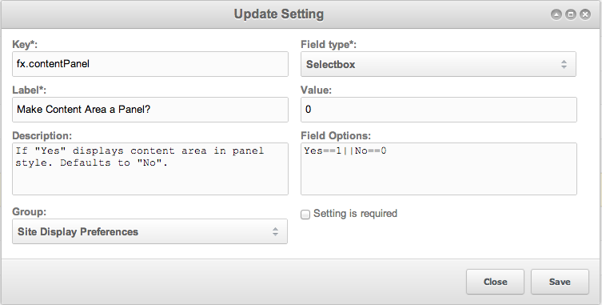

ClientConfig is an extra for MODX Revolution 2.2 and up, allowing administrators to set up easy configuration options for clients. Define groups (tabs) and settings with various input types and let your clients do the rest, while using settings in templates or in code.

ClientConfig is maintained by Mark Hamstra on Github, please file your bugs and feature request there. Pull requests are welcomed as well! <https://github.com/Mark-H/ClientConfig>. The first release was on December 9th, 2012 and is available from [MODX.com](http://modx.com/extras/package/clientconfig).

[Discuss ClientConfig on the Forums](http://forums.modx.com/thread/81490/clientconfig-custom-configuration-cmp-for-clients#dis-post-449423).

## Setting up Configuration Options

ClientConfig lets you define what you want your client to manage. Therefore ClientConfig ships as an empty canvas, waiting for you to set up the relevant settings.

Open up ClientConfig from the Components menu, and click on Admin in the top right to start. Let's start by creating a group on the Groups tab. Groups are used to categorize settings in tabs on the clients view, and if you don't assign a setting to a group it will not be visible for the client.. Let's create a new group by clicking on the New Group button. Give it a name and a description.

Now we can add some settings in the Settings tab. Simply click the Add Setting button and fill out the form; we'll go over some of the options below.

## Settings

Settings contain a number of fixed options:

- **key**: the key that you will use to reference the setting when retrieving the setting values: `[[++key]]` or $modx->getOption('key') in code.
- **label**: the visible name of the field.
- **xtype** (field type): a valid field type; see specifics below.
- **description**: description of the field to provide extra context for the field. Visible on hover over the field.
- **is\_required**: if the field needs to have a value, tick the box.
- **value**: the currently stored value for this field.
- **default**: a default value (sorta deprecated)
- **group**: the group this field should be shown in
- **options**: field-specific configuration; only available for a subset of the field types. See specifics below.

After creating the settings and saving them, they will be available as `[[++key]]`or with $modx->getOption('key') in code.

If there are system settings or context settings with the same `[[++key]]` the settings in ClientConfig will override those.

## Field Types

You can choose a number of field types for your configurations. The xtype in brackets is for hardcore ExtJS ninjas that want to know what is used behind the scenes to craft the form.

- Text (xtype: textfield)
- Textarea (xtype: textarea)
- Number (xtype: numberfield)
- Checkbox (xtype: xcheckbox)
- Date (xtype: datefield)
- Time (xtype: timefield)
- Selectbox (xtype: modx-combo); properties: Text==value||Text2==value

You can use the Selectbox field type to mimick the boolean yes||no behaviour of certain System Settings by setting the field options like the screenshot example:

