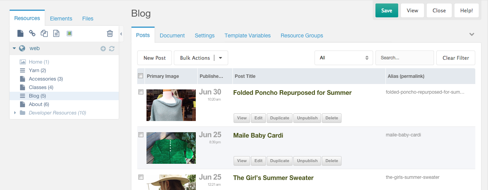
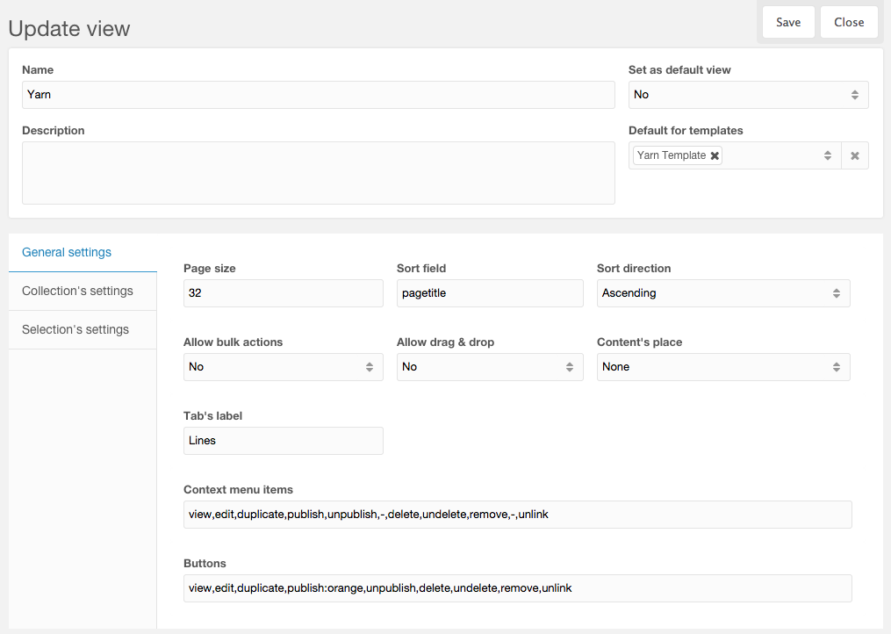
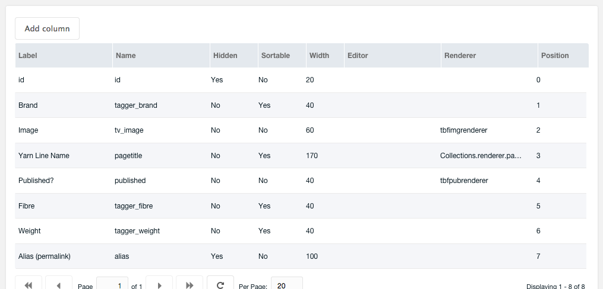

 Collections is a MODX Revolution Extra that adds a custom `CollectionContainer` resource class with the following behaviour:

1. Any direct child resource will be hidden from the Resource Tree in the Manager, and listed in a grid view (similar to Articles) under a dedicated “Children” tab.
2. Any children that themselves have children will be shown in the Tree, to be managed normally.

 

### Sub Collections

 Just like the MODX Resource Tree itself, Collections supports nesting. You can create a Collection within another Collection. Sub Collection Containers will be displayed in the resource tree and their children will be displayed in the grid view.

### Drag n Drop

 You can drag n drop Resources into a Collections container and if they don’t have children of their own they will be listed in the grid. If they do have children, they’ll just remain in the Tree as usual.

## Collections Templates (new in version 2)

### General Settings

 

- Set as default view - If "Yes", this Collections View Template (CVT) will be used as a last fallback.
- Default for templates - This will be the default CVT for Resources using these MODX Templates. Can be overridden on a per-resource basis in the Collections vertical-tab of the Collections resource's Settings.
- Page size - Default number of children to display per page in the grid.
- Sort field - Default field to sort by (Same rules as for name in columns definitions).
- Sort dir - Default sort direction.
- Allow bulk actions - Enables checkboxes for multi-item selection, and bulk actions on those selections.
- Allow drag & drop - Enables drag & drop sorting.
- Content's place - Position of the standard Resource content field.
- Tab's label - Customize the label text for the "Children" tab.
- Context menu items - Customize the items in the context menu (when you right-click in the grid).
- Buttons - Customize the buttons rendered, when using a renderer that renders buttons. Optionally add classes to each button with a colon ":" separator.

#### Permanent sort

 From version 3.2.0, new fields were added to general setting: **Permanent sort - Before** and **Permanent sort - After**. They allow adding more sort options to children's grid and they will be applied together with the default sort option (and also with sorting after clicking a column header). **Before sort** is used before the default sort, **after sort** is used after the default.

**Syntax for both fields:**

``` plain
sort_field_condition=sort_field:sort_dir:sort_type,sort_field_condition2=sort_field2:sort_dir2:sort_type2<br>*=sort_field:sort_dir:sort_type,sort_field_condition2=sort_field2:sort_dir2:sort_type2<br>sort_field:sort_dir,sort_field_condition2=sort_field2
```

- sort\_field\_condition - Sort options will be applied only if table is sorted by this field, this item is optional, if it's not present, or is set to **\*** sort will be applied everytime
- sort\_field - Field to filter by, **required**
- sort\_dir - Direction to sort, optional, if not present sort direction from table will be used
- sort\_type - Allows casting type to a field, optional

### Example

``` plain
publishedon=published:asc
-- Setting above as Permanent sort - Before will pull all unpublished resources on top of the grid when sorting by published on. Because sort_dir is present, doesn't matter if you sorting asc/desc by published on, unpublished resources will always be on top.
```

### Collection's settings

 

- Resource type selection - Enable Resource type selection when creating a new Resource using the "New Child" button.
- Default children's resource type - Set a default Resource type for newly created child Resources.
- Default children's template - Set a default Template for newly created child Resources.
- New child's button label - Customize the label text on the "New Child" button.
- Allowed resource types - Limit the allowed Resource types to a comma-separated list, if Resource type selection is enabled.

### Columns

 

- Label - String or lexicon entry key (you can add your own lexicon entries under the collections namespace into the topic templates) that will be used as a column label.
- Name - Name of the field; can be any field from modResource, any TV name (prefixed with tv\_, **TV name must NOT contain a dot**) or any Tagger group alias (prefixed with tagger\_)
- Hidden - If "Yes", column will be hidden by default.
- Sortable - If "Yes", user will be able to sort the grid by the values in this column.
- Width - Width of column.
- Editor - (string) Xtype or (object) JSON of valid editor.
- Renderer - Name of function that will be used as a renderer.
- Position - Order of columns.

### Editors

 As an editor can be used any valid xtype (string) or JSON object.
 Examples:

- textfield
- textarea
- modx-combo-boolean
- numberfield
- {"xtype":"numberfield","allowDecimals":false,"allowNegative":false}

### Renderers

 As a renderer, you can use any [function](http://docs.sencha.com/extjs/3.4.0/#!/api/Ext.grid.Column-cfg-renderer) with proper arguments.
 Available renderers:

- **this.rendYesNo** - Yes/No (1/0) boolean values, coloured in green and red, respectively
- **Collections.renderer.qtip** - On hover will show a qtip with value (useful for longer values)
- **Collections.renderer.pagetitleWithButtons** - Pagetitle (in h2 element) with link to edit and buttons for update, view, delete, publish (ala Articles grid view)
- **Collections.renderer.pagetitle** - Pagetitle (in h2 element) with link to edit
- **Collections.renderer.pagetitleLink** - Pagetitle with link to edit (smaller text than h2)
- **Collections.renderer.datetimeTwoLines** - Date on first line and time on second line. Date and time formats are configurable via system settings
- **Collections.renderer.datetime** - Date and time on one line. Date and time formats are configurable via system settings
- **Collections.renderer.image** - Image thumbnail

#### Custom renderers

 Custom renderers can be easily added by creating a JS file (and CSS file if needed) and specifying URLs to those files in system settings. JS files can contain [functions](http://docs.sencha.com/extjs/3.4.0/#!/api/Ext.grid.Column-cfg-renderer) (see [sample](https://github.com/modxcms/Collections/blob/develop/assets/components/collections/js/mgr/extra/collections.renderers.js) renderers here) that can then be used collectively.

## Selections (new in version 3)

 Selections are essentially links to other Resources in the same MODX site. You are not duplicating the original Resources when you add them to a Selections container, but simply creating another view from which to manage those Resources.

### ExampleUse Case 1

 You want to create a menu with links to Resources that are in disparate parts of the Tree. Those Resources rightfully "belong" where they are in the site's content structure, so the solution thus far has been to create a container Resource in the Tree specifically for this menu, and create Weblink Resources therein. But really the Weblinks add no value other than they can be controlled in another list. Instead, add those Resources to a Selections container, which maintains its own menuindex values for each Resource, and using the getSelections Snippet, you can list Resources sorted by those, special menuindex values.

### ExampleUse Case 2

 You want to populate a widget with links to other Resources on your site, but again the Resources come from various sections, or you wish to manually curate the widget contents rather than automate it. Selections provides an alternative to, say, MIGX, when you need a management UI for arbitrary "Selections" of Resources, no matter where they exist in the site (even if they live under a "Collections" container, for example).

### getSelections Snippet

``` php
[[getSelections?
    &selections=`[[*id]]`
    &tpl=`myTplChunk`
]]
```

 getSelections is a wrapper Snippet for getResources, so it relies on getResources being installed. Any / all of the getResources properties available in the version of getResources that you have installed will also be available as properties for getSelections. Additionally here are the properties specific to getSelections:

- &selections - the ID of the Selections container Resource.
- &getResourcesSnippet - You can optionally name another listing Snippet to call with getSelections, but this has not been thoroughly tested with other Snippets, and should probably only be used if you're able to troubleshoot both getSelections and the Snippet you're calling.

### Selection's settings

 

- New link's button label - Customize label text on the "New Link" button.

## Additional Resources

- [Collections: Customizable Views for Content Types](http://modx.com/blog/2014/09/30/collections-easily-customizable-admin-views-for-content-types/)
- [Collections 3](http://www.bxr.cz/blog/collections-3/)
- [Collections: Enhanced sort](http://www.bxr.cz/blog/collections-enhanced-sort/)
