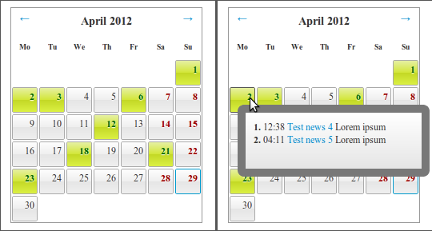

## Description

eventsCalendar2 is designed to generate calendar and display the events. It can be resources or custom json-string with events array.

Perfect for the displaying of various meetings, news, events, etc.

### Requirements

- MODX Revolution 2.1 or later
- PHP5 or later

### Homepage and Demo

<http://bezumkin.ru/modx/eventscalendar2/>

On this page events are [generated by special snippet](extras/eventscalendar2/eventscalendar2.generating-events "eventsCalendar2.Generating events"). You can click on prev/next month infinitely.

### Download

It can be downloaded from within the MODX Revolution manager via [Package Management](developing-in-modx/advanced-development/package-management "Package Management"), or from the MODx Extras Repository, here: <http://modx.com/extras/package/eventscalendar22>

### Development and Bug Reporting

eventsCalendar2 is stored and developed in GitHub, and can be found here: <https://github.com/bezumkin/eventsCalendar2>

Bugs can be filed here: <https://github.com/bezumkin/eventsCalendar2/issues>

## Usage

eventsCalendar2 currently comes with one Snippet:

- [eventsCalendar2](http://rtfm.modx.com/display/ADDON/eventsCalendar2.eventsCalendar2) - For generate calendar with events.

And four Chunks:

- [tplCalendar2](extras/eventscalendar2/eventscalendar2.tplcalendar2 "eventsCalendar2.tplCalendar2")
- [tplHead2](extras/eventscalendar2/eventscalendar2.tplhead2 "eventsCalendar2.tplHead2")
- [tplCell2](extras/eventscalendar2/eventscalendar2.tplcell2 "eventsCalendar2.tplCell2")
- [tplEvent2](extras/eventscalendar2/eventscalendar2.tplevent2 "eventsCalendar2.tplEvent2")

## See Also

1. [eventsCalendar2.eventsCalendar2](extras/eventscalendar2/eventscalendar2.eventscalendar2)
2. [eventsCalendar2.Generating events](extras/eventscalendar2/eventscalendar2.generating-events)
3. [eventsCalendar2.tplCalendar2](extras/eventscalendar2/eventscalendar2.tplcalendar2)
4. [eventsCalendar2.tplCell2](extras/eventscalendar2/eventscalendar2.tplcell2)
5. [eventsCalendar2.tplEvent2](extras/eventscalendar2/eventscalendar2.tplevent2)
6. [eventsCalendar2.tplHead2](extras/eventscalendar2/eventscalendar2.tplhead2)
