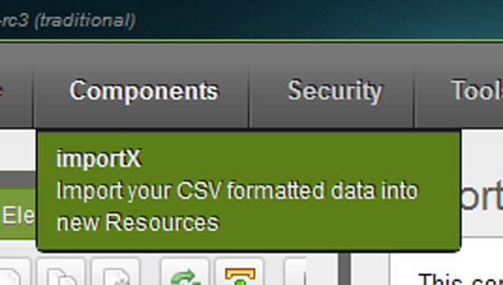
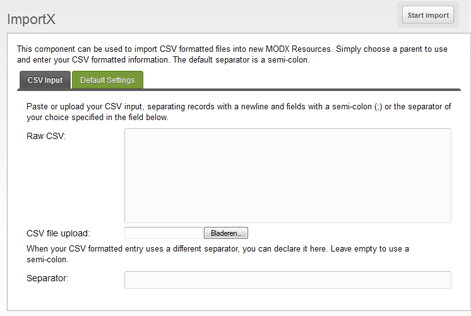
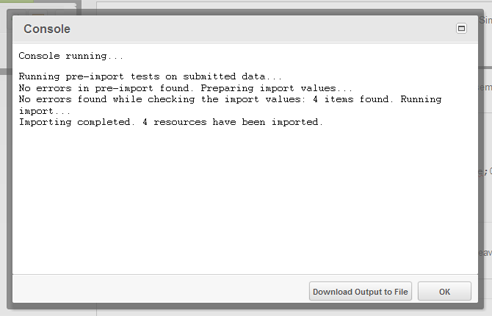

## What is ImportX?

ImportX is a MODX extra that can be used to quickly create new resources from CSV input. This can be either pasted in a textarea, or by uploading a .txt or .csv file.

Development was funded by Working Party, a Sydney based Digital Agency.

## Requirements

- MODX 2.1+

## History

Initial development started in April 2011 by Mark Hamstra.

## Usage



 Using ImportX is as simple as presenting it with your CSV values and setting a few options depending on your situation.

After installation through the Package Manager, refresh the page and find ImportX in the Components menu (see image to the right). Open it and have a look at what options are available. Most of it is pretty self explanatory.

### CSV Input tab



The image to the left shows the screen available to you (ImportX 1.0-rc). Most notably, you can find a big textarea where you can enter raw CSV or choose to upload a csv file in the input field below that.

You will also see a field for the "Separator", which is the string between two columns of the CSV. This could be anything including multiple characters long, but is a semi-colon by default ";".

The last thing you should know about this tab and the component in general is where to find the submit button.. if you haven't noticed yet, it's in the top right of the workspace.

ImportX doesn't really care about what format your CSV is, as long as:

- It knows what separator to use. By default it uses ";" (semi-colon) but you can change it on the CSV Input tab.
- The first row contains the "heading", in other words tells you where the columns should be filed under. This can contain resource fields (example: pagetitle;alias;richtext) but also Template Variables. Template Variables need to be listed as "tvN" where N is the ID of the template variable it needs to be filled in. An example header row could be pagetitle;alias;richtext;tv3;content;tv4.
- There needs to be at least one value row.
- Every row has the same number of elements. An element or cell is the value of a certain record that needs to be added as the value of a certain field.
- The header row needs to have the same amount of elements as the value rows.

### Default Settings

The Default Settings tab contains a couple of settings you can set by default. 

It is important to note that this sets the default behavior - also when you did not specify it, as it will then default to being false!

As of 1.0.0-rc you can set:

- Parent: either an integer referencing an existing resource ID, or a context\_key to import to the root of the context\_key context, or 0 to import to the root of the default web context.
- Published: whether the resource should be published by default.
- Searchable: whether the resource should be searchable by default
- Hide from menus: whether the resource should be hidden from menus by default.

### Doing the magic (and troubleshooting errors)

After clicking the "Start Import" button, the script will get to action and start parsing your CSV. If all is good, this is how the resulting output could look:


 At that point you can choose to download the output, or just close the window. The resource tree will refresh automagically after that to show what has happened.

If you get any other output, see the below table and what you could do to fix it.

| Error                                                                                             | Cause                                                                                                                                                                                                                     | How to fix                                                                                                                                                         |
| ------------------------------------------------------------------------------------------------- | ------------------------------------------------------------------------------------------------------------------------------------------------------------------------------------------------------------------------- | ------------------------------------------------------------------------------------------------------------------------------------------------------------------ |
| Please choose a Parent to import to. Specify 0 to put new resources in the root of the site.      | The "parent" field on the Default settings tab was empty. You will always need to specify either 0, a valid resource ID or a context\_key.                                                                                | Adjust the value in the "Parent" field on the default settings tab.                                                                                                |
| Parent not numeric or valid context key.                                                          | 1. The "parent" field is not numeric.                                                                                                                                                                                     |
| 2. A context\_key value passed in the Default settings tab does not exist.                        | 1. Change the parent field to a numeric value.                                                                                                                                                                            |
| 2. Check the spelling of your context\_key.                                                       |
| Parent needs to be a positive integer.                                                            | You specified a negative number in the parent field.                                                                                                                                                                      | Specify 0 or a positive number in the parent field.                                                                                                                |
| Please add your CSV values in order for them to be processed.                                     | You didn't specify any CSV values.                                                                                                                                                                                        | Add some manual input or upload a file.                                                                                                                            |
| Error reading the uploaded file.                                                                  | You uploaded a file but there was an error reading it. This could be caused by an error in the file or an error on your server reading from the temporary folder.                                                         | Make sure your file is not corrupt. Possibly check your open\_basedir settings.                                                                                    |
| Invalid CSV value posted.                                                                         | The total length of the CSV you posted was under 10 characters, and is considered invalid.                                                                                                                                | Make sure your CSV input is at least 10 characters long.                                                                                                           |
| Not enough data given. Expecting at least one header row, and one data row.                       | The script expects at least a header and value row and you didn't pass this. Note that a row is expected to be separated by a newline (\\n).                                                                              | Check your CSV input to make sure the rows are seperated with a newline.                                                                                           |
| Element count do not match. Please check for correct syntax on line `[[+line]]`.                  | One row has more or less elements, while this needs to be exactly the same for every row. A common cause would be the occurrence of the separator in a value field.                                                       | Make sure you use trailing separators consistently and your separator is not used in a field value. If it is, use a different seperataro.                          |
| An unexpected error occurred saving the resource.                                                 | The MODX Processor returned an error. Prior to 1.0.0-pl this would only say "Array", but this was fixed in 1.0.0-pl. Various causes can cause this to show, but it will often involve security.                           | Depends on the specific error.                                                                                                                                     |
| Your header has one or more invalid fieldnames. The invalid fieldname(s) is (are): `[[+fields]]`. | The header row has unrecognized fieldnames. It will output the errors. Make sure you spelled all the fields properly. In some cases when uploading a file encoding issues can arise due to the way it is being processed. | Fix the fieldnames (and use TVs in the form "tvN" where N is the id of the TV itself), or open your file in notepad and paste the content in the Raw CSV textarea. |
| `[[+field]]` (`[[+int]]` is expected to be an integer                                             | A header element was found that started with "tv", however `[[+int]]` is not a number and can't be used to find the TV to add data to.                                                                                    | Fix the header row element.                                                                                                                                        |
| `[[+field]]` (no TV with an ID of `[[+id]]`)                                                      | A header element referencing a TV was found, but there was no TV with that ID.                                                                                                                                            | Fix the header row element.                                                                                                                                        |

### ExampleCSV and some CSV-related notes

``` php
pagetitle;alias;isfolder
Analysing;analysing;1
Communicating;communicating;0
Rock solid copy;sepiariverstudios;0
Editing your resources remotely;modxmobile;0
```

(Real basic bogus example, I welcome a better example!)

Here's some CSV-related notes:

1. Make sure you don't use the separator in the content field. You could use a separator like ";;;" when importing lots of content that may contain the default separator ";".
2. When importing data which includes a template or user (createdby etc) column, make sure your CSV passes the ID of the related object, and not the name.
3. You can import **TV Values** by creating column headings as "tv4" where 4 is the ID of the TV.
4. Any paragraph breaks in your imported data will contain "\\n", or new-line characters. These must be removed, or replaced with something else, as ImportX wrongly recognises them as end-of-record markers.
5. CSV files quite often have an extra blank record appended at the end. You may need to remove this last record using something like Notepad++.

### Execution Time Issues

As of ImportX 1.1 the import will attempt to set the time limit and report you of the results.

If you are on Windows/IIS and suffer the script timing out after roughly 30 seconds, [check out the solutions posted on the forums](http://forums.modx.com/thread/71118/can-importx-import-7-000-records#dis-post-397394).

### Updating Data instead of creating new Resources

As of 1.1 you can change the importx.processor system setting from "create" to "update" to update resources based on the ID you pass along with the query. If the resource can't be find it will be created.

## Other formats than CSV

As of 1.1, it is possible to add more formats as the addon has been somewhat normalized.

This can be achieved by writing a new class (see core/components/importx/processors/prepare/ - the prepare.class.php is the base class which you should extend, and csv.php is the current one in use) and changing the new importx.datatype system setting to the name of your file (minus the ".php" parts).

At this point there's only the CSV file, but I will very very very much appreciate someone coming up with XML or other formats. Feel free to contact me (hello@markhamstra.com) if you're interested but need some help figuring out what to do.

## And now...

Go use it!

If you encounter any issues that were not mentioned above, please do let me know on Github: <https://github.com/Mark-H/importX>

Github is also the place to report Bugs and Feature requests. The issue tracker shows an overview of what features are planned for a later release as well.
