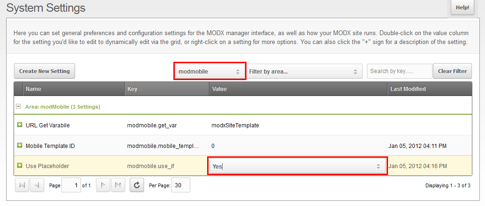
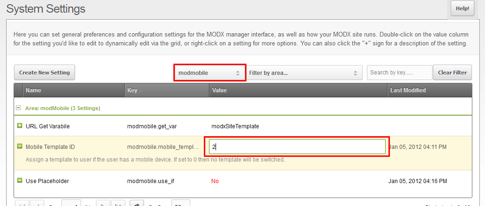

## What is modMobile?

modMobile is a plugin that changes your template when a mobile device visits your site.

## History

| Version                                              | Release date  | Contributors   | Remarks / highlights                  |
| ---------------------------------------------------- | ------------- | -------------- | ------------------------------------- |
| 1.0 pl                                               | Jan 5th, 2012 | Josh Gulledge  | Added Snippet and refactored the code |
| [0.1.0 alpha](http://modx.com/extras/package/moddef) | Mar 03, 2011  | Jeroen Kenters | Initial release.                      |

### Requirements

- MODX Revolution
- Mobile template

### Development & Bug reporting

modMobile is currently being developed on Github. That is also the place to **[report bugs](https://github.com/jgulledge19/modMobile/issues)**, file **feature requests** and **improvements**.

## Upgrading

You may have to set the value of the System Setting modmobile.mobile\_template as this has changed form just mobile\_template. If you sit have the original setting mobile\_template remove it.

## Installation

Install through Package Management

### Troubleshooting

Since this is an early beta, a lot of things might go wrong after installing this package. Just disable the plugin if you run into any problems and you should be fine. Don't forget to report bugs on our [github page](https://github.com/jgulledge19/modMobile/issues)!

## Usage

### Example1

Using one template for mobile and full site

1. Go to System -> System Settings
2. Set the USE Placeholder to Yes
   
  
3. Lets assume that the only difference between your standard version and the mobile version is the CSS file then in your template do something like this:

``` php
[[If?
    &subject=`[[+modxSiteTemplate]]`
    &operand=`mobile`
    &then=`<link rel="stylesheet" type="text/css" media="all" href="/assets/templates/css/mobileLayout.css" />`
    &else=`<link rel="stylesheet" type="text/css" media="all" href="/assets/templates/css/commonLayout.css" />
    <!--[if IE 6]>
        <link rel="stylesheet" type="text/css" media="all" href="/assets/templates/css/ie6.css" />
    <![endif]-->`
]]
```

Note: modxSiteTemplate is the value of modmobile.get\_var and the same that you will need to send to the url to switch templates. You must also install the If extra for this example to work!

1. Now just put a link in your template to the mobile version and then to the full version:

``` html
<!-- Moblie Link -->
<a href="[[~[[*id]]]]?modxSiteTemplate=mobile">Mobile</a>
<!-- Back to Full site link -->
<a href="[[~[[*id]]]]?modxSiteTemplate=full">Full Site View</a>
```

Note this is optional but highly recommended.

### Example2

Using a separate mobile template

1. Go to System -> System Settings
1.1. Select modmobile, see image
1.2. Enter in your mobile template ID
  
2. Just visit your site on a mobile device like an iPhone or iPad. Your mobile theme should show up.
3. Now just put a link in your templates a link to the mobile version and then to the full version like so:
  Note this is optional but highly recommended.
  
 ``` html
<!-- Moblie Link -->
<a href="[[~[[*id]]]]?modxSiteTemplate=mobile">Mobile</a>
<!-- Back to Full site link -->
<a href="[[~[[*id]]]]?modxSiteTemplate=full">Full Site View</a>
```
