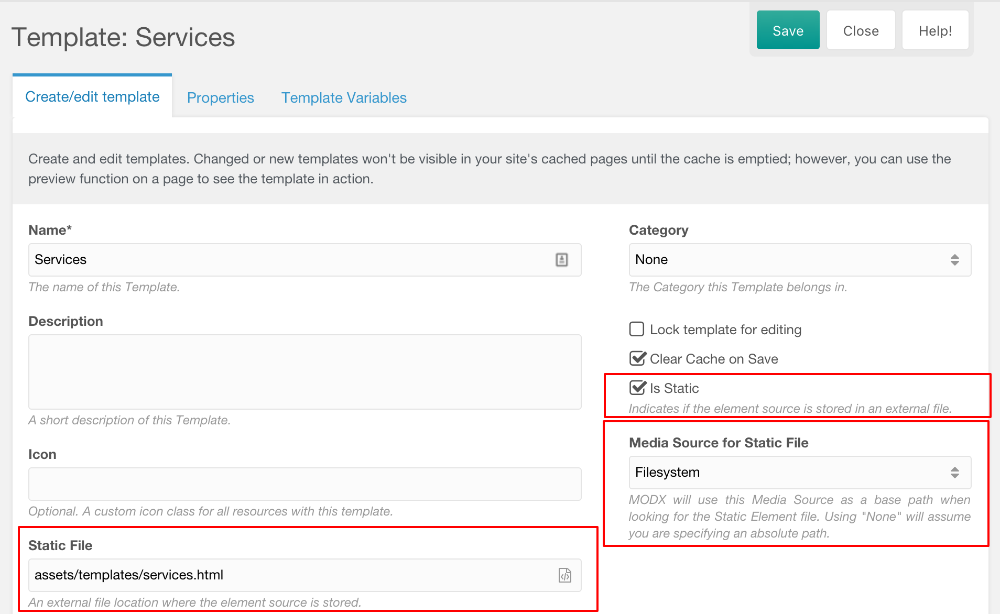

Начиная с MODX Revolution 2.2 вы можете создавать статические элементы, чтобы упростить управление ими. Эта функция доступна для всех элементов, включая шаблоны, сниппеты, чанки и плагины.

Статический элемент - это элемент, который получает свое содержимое из файла. При редактировании через менеджер файл будет обновляться. Точно так же, когда вы редактируете файл через IDE, он будет обновляться в MODX при следующем запросе элемента.

Чтобы создать элемент в качестве статического элемента, просто установите флажок _Статичный_, выберите Media Source и добавьте путь к файлу, относящемуся к этому источнику медиа, к входу _Статичный файл_. Вы также можете щелкнуть значок на входе _Статичный файл_, чтобы открыть браузер MODX для выбора файла, а не вводить его вручную.

Этот процесс одинаков для всех типов элементов.

Имейте в виду, что MODX по-прежнему сохраняет содержимое в базе данных, чтобы элемент мог обрабатываться нормально. MODX проверяет содержимое файла только тогда, когда элемент запрашивается без кэширования, поэтому обязательно очищайте кеш при разработке. По этой причине статические элементы могут оказаться наиболее полезными при работе с некэшированными фрагментами или плагинами и несколько менее полезными для шаблонов и блоков.

Чтобы улучшить опыт редактирования со статическими элементами, есть несколько дополнительных функций, которые могут помочь автоматически создать элементы в базе данных MODX или автоматически очистить кэш для вас.
