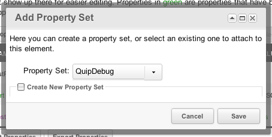
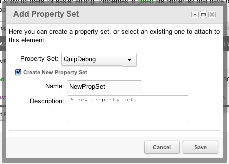
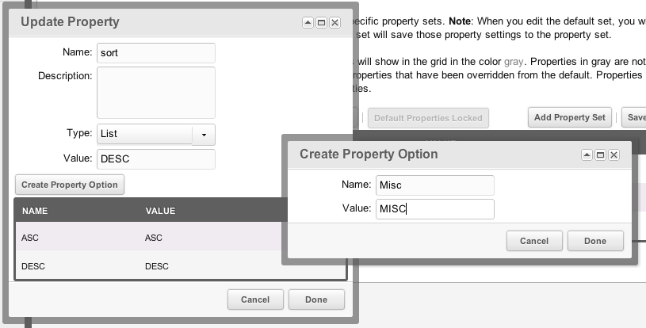

## Что такое параметры?

Параметры - это некоторые значения, которые можно задать для любого элемента с помощью [Синтаксиса тегов](building-sites/tag-syntax "Синтаксиса тегов"). Примером параметра является параметр 'debug' в вызове сниппета:

``` php
[[Quip? &debug=`1`]]
```

'debug' - это параметр, где '1' - это значение данного параметра. Они передаются парсеру элемента и там интерпретируются. Сниппеты и плагины могут получить к ним доступ через массив $scriptProperties или прямо через значения ключей.

## Что такое наборы параметров?

Наборы параметров - это пользовательские наборы параметров для элемента. Т.е., вместо огромного вызова сниппета с не читаемым длинным списком параметров, вы можете хранить все параметры в одном месте в виде набора:

``` php
[[MySnippet? &prop1=`a` &prop2=`b` &prop3=`c` &prop4=`d` &prop5=`e` &prop6=`f`]]
... станет ...
[[MySnippet@myPropertySet]]
```

Наборы параметров могут быть привязаны не только к сниппетам, но и к _любому элементу_ через страницу редактирования этого элемента, а один набор параметров может использоваться сразу несколькими элементами. После того, как набор параметров был задан и привязан к элементу, вы можете вызвать его по имени, используя символ "@":

``` php
[[ElementName@PropertySetName]]
```

Итак, для примера, у нас есть набор параметров с двумя параметрами - для 'debug' установлено значение true, а для 'user' установлено значение 2.
Затем давайте вызовем набор параметров во сниппете:

``` php
[[TestSnippet@DebugMode? &user=`1`]]
```

В этом примере вызывается сниппет "TestSnippet", загружается набор параметров "DebugMode", а затем устанавливается значение 'user' равным 1. Поскольку параметр 'user' задан как 2 в наборе параметров, то он будет переопределен в вызове и, в конечном итоге, примет значение 1.
Порядок загрузки параметров:

> Параметры элемента по умолчанию -> Наборы параметров -> Параметры, заданные тегами

Итак, если параметр по умолчанию 'user' был 0, тогда он будет установлен равным 2 с помощью набора параметров, а затем равным 1 с помощью вызова в теге.
Набор параметров также может содержать параметры, не определенные ни в параметрах элемента по умолчанию, ни в вызове тега. Это может быть полезно для загрузки элементов по всему сайту без необходимости повторять вызов одинаковых тегов, что значительно упрощает управление вызовам тегов.

Параметры будут переданы в элемент так же, как они передавались в MODx 0.9.6, но теперь они также передаются через массив $scriptProperties, для тех, кто хочет большей гибкости, зная какие параметры передаются.

## Назначение наборов параметров элементам

Наборы параметров могут использоваться только для элементов, которым они назначены. Это можно сделать либо через вкладку "Параметры" элемента, либо через меню "Наборы параметров".

В меню "Наборы параметров" нажмите правой кнопкой мыши на набор параметров и выберите "Связать с элементом". Сначала выберите имя класса элемента, затем выберите сам элемент. Вы можете прикрепить несколько элементов к одному и тому же набору параметров.

Например, вот представлен набор параметров с именем "TestPropertySet" на странице редактирования сниппета:


Как вы можете видеть, есть набор параметров с параметрами разного цвета. Параметры зеленого цвета - это параметры по умолчанию, которые были переопределены в наборе параметров. Параметры фиолетового цвета - это параметры, которых нет в параметрах элемента по умолчанию, но они определены в наборе параметров.
Параметры могут иметь описания - значок "+" слева, при нажатии на который снизу появится описание.

Чтобы добавить набор параметров в элемент, нужно нажать "Добавить набор параметров" в правом верхнем углу списка, во вкладке "Параметры" элемента. Появится окно:



Здесь вы можете выбрать набор параметров, который хотите добавить. Если вы хотите создать совершенно новый набор параметров и автоматически привязать его к этому элементу, вы можете сделать это, установив флажок "Создать новый набор параметров", и появятся следующие поля:



Затем, после сохранения нового набора параметров, он будет автоматически привязан к этому элементу.

## Создание параметров в наборе параметров

Чтобы создать параметр в наборе параметров, вам нужно выбрать набор параметров, над которым вы хотите работать, а затем нажать "Создать параметр". Появится окно:



Здесь вы можете создать параметр и связанные свойства. Обратите внимание, что мы создаем параметр типа "Список", которое является раскрывающимся параметром. Вы можете добавить свойства к этому параметру из сетки. После сохранения, он будет добавлен в набор параметров.

## Импорт и экспорт параметров

Вы также можете импортировать и экспортировать параметры в списке. Просто нажмите на соответствующие кнопки снизу.

Когда вы импортируете параметры, импорт перезапишет ваши параметры в списке. Убедитесь, что вы хотите сделать это перед импортом!

## Использование параметров программно

Свойства доступны в сниппете через массив $scriptProperties:

``` php
$prop = $scriptProperties['propertyName'];
```

Обратите внимание, что если в вызове сниппета вызывается параметр, имя которого совпадает с именем параметра в наборе параметров, то значение параметра переопределит его значение по умолчанию в наборе.

### Использование getOption

Вы также можете получить параметр сниппета с помощью $modx->getOption() следующим образом:

``` php
$modx->getOption('propertyName', $scriptProperties, 'default');
```
