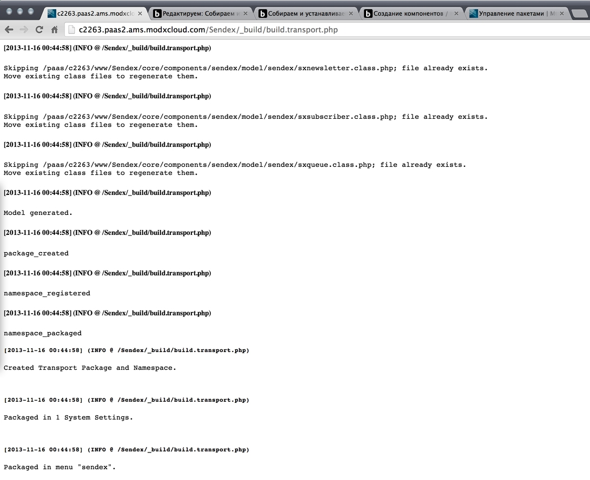
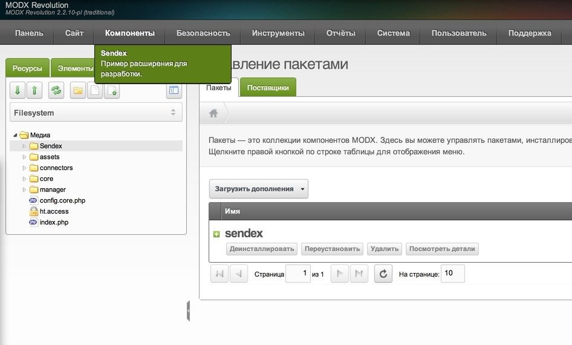
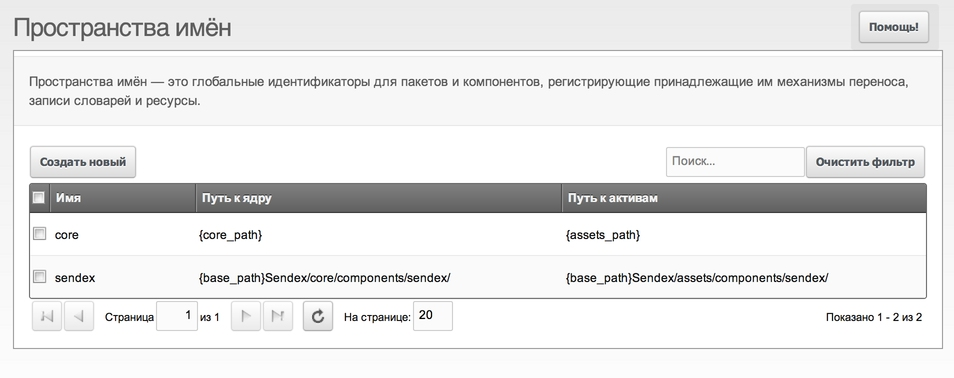
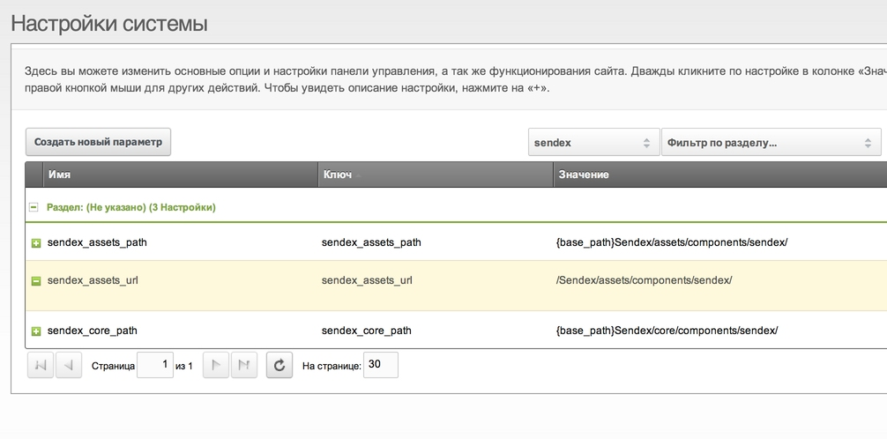
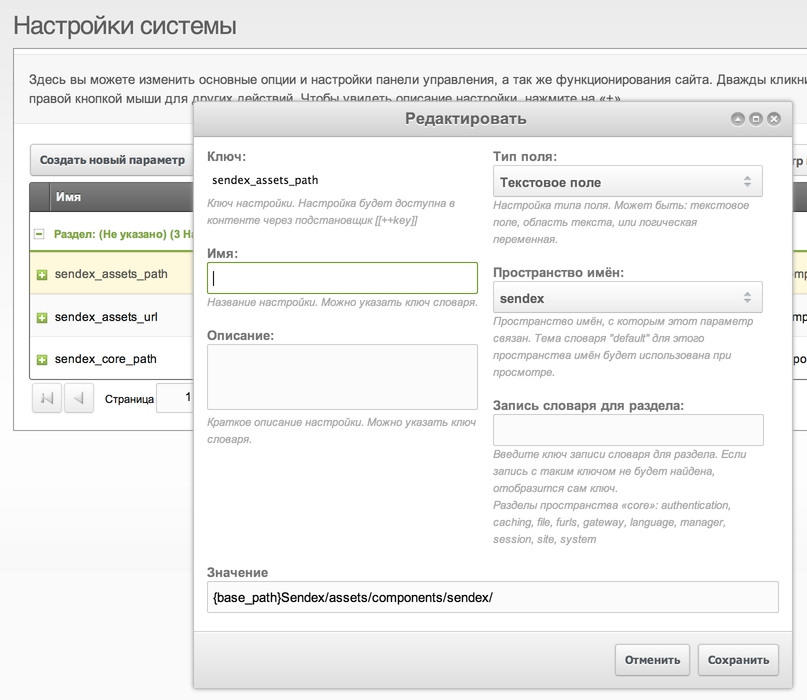
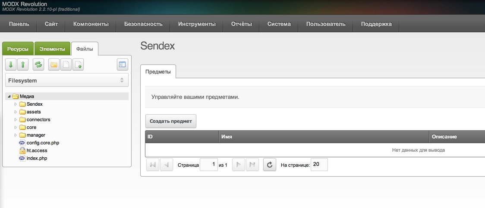
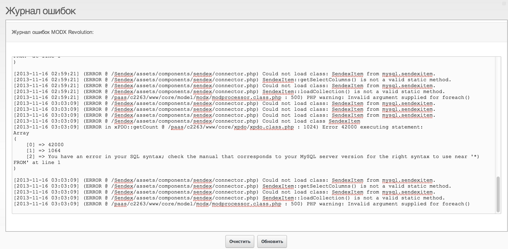
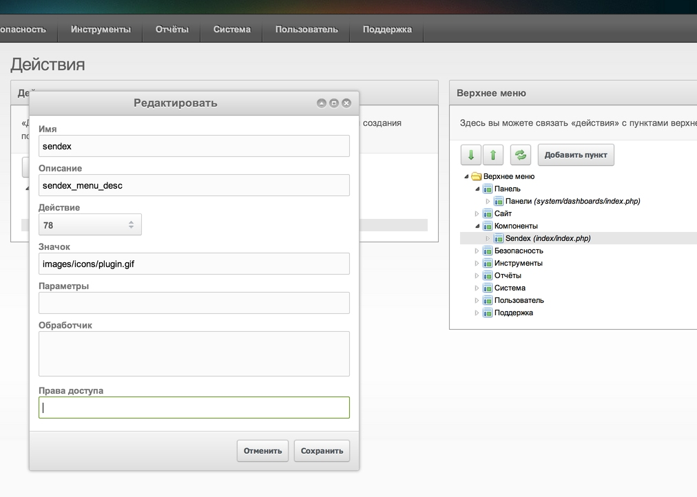

На прошлом занятии мы определились с примерным функционалом, написали схему таблиц и сгенерировали модель xPDO для работы с БД MySql.

А сегодня нам нужно собрать и установить первую версию пакета и разобраться, как работают [Custom Manager Pages](extending-modx/custom-manager-pages "Custom Manager Pages").

Учитывая, что мы используем заготовку modExtra, и уже разобрали, как она работает — сборка пакета заключается в выполнении скрипта `build.transport.php` на сервере.

Если в конфиге `build.config.php` выставлена константа `PKG_AUTO_INSTALL`, то компонент будет сразу установлен на сайт.

Итак, я запускаю `c2263.paas2.ams.modxcloud.com/Sendex/_build/build.transport.php` и в конфиге у меня включена автоустановка, поэтому сразу после сборки пакета им уже можно пользоваться.





Иначе нужно было бы зайти в управление пакетами, поискать их локально, и установить. Пакеты я собираю часто, и делать это каждый раз давно надоело.

Давайте теперь разберем, как же работает CMP — то есть, наш новый раздел админки Sendex.

## Меню

Все меню MODX состоят из двух частей: собственно пункт меню и действие, которое он вызывает. Как и всё в Revolution, меню и действие — тоже объекты, и мы устанавливаем их в файле [transport.menu.php](https://github.com/bezumkin/Sendex/blob/master/_build/data/transport.menu.php).

Видите, там в массиве с пунктами меню (у нас он один) modMenu, есть и ключ **action** — вот это и есть параметры для создаваемого modAction.

Если мы захотим туда добавить еще одни пункт, то будет примерно так:

``` php
$tmp = array(
    'sendex' => array(
        'description' => 'sendex_menu_desc',
        'action' => array(
            'controller' => 'index',
        ),
    ),
    'another_menu' => array(
        'description' => 'Мое описание',
        'action' => array(
        'controller' => 'а здесь файл-контроллер',
        ),
    ),
);
```

Еще мы можем указать, в каком родительском меню будет находиться наш пункт — это параметр **parent**, и в нашем случае он стандартный — **components**.

А вот у miniShop2, который изначально планировался под расширения, меню находится не в components, корне — вот, посмотрите на его [transport.menu.php](https://github.com/bezumkin/miniShop2/blob/master/_build/data/transport.menu.php). Первый пункт там имеет `parent = ''`, а следующие уже `parent = 'minishop2'`.

Для таких случаев нужно еще использовать параметр **handler** — это javascript функция, которая будет вызвана при клике на пункт меню. Для основного пункта меню MS2, который является просто контейнером подменю, это `return false;` — то есть, не делать ничего при клике.

Но у нас случай простой, можно сказать классический — один CMP и один пункт меню, который лежит в components.

Как правило (не не обязательно), modMenu связан с `modAction` — его цель состоит в запуске определённого контроллера. Поэтому с массиве с action мы указываем пункт **controller**.

## Настройка для разработки

Прежде чем перейти к разбору контроллера, нужно сделать кое-какие настройки, чтобы нам было удобно работать на удалённом сервере.

Напоминаю, что весь наш проект находится в директории Sendex в корне сайта. А только что установленный пакет распаковался в `/core` и `/assets` и теперь, если мы что-то меняем — то это синхронизируется с директорией в корне, а на установленные файлы никак не влияет.

И тут у нас 2 варианта: после каждого изменения собирать и устанавливать пакет, или научить MODX загружать скрипты из директории `/Sendex`.

Конечно, второй вариант предпочтительнее, поэтому идём в **Система → Пространства имён** и делаем так:



Это позволит MODX обращаться за исходниками в нашу директорию. А теперь нужно создать еще системные настройки `sendex_core_path` и `sendex_assets_url` (а демонстрационную настройку `sendex_some_setting` можно удалить):





`sendex_assets_path` необязательна, но тоже может пригодиться. Эти настройки нужны нам, чтобы знать, где искать наши файлы.

В принципе, можно не создавать их, а каждый раз доставать `modNamespace`, но это не очень удобно.

С этого момента мы можем получать рабочие директории проекта вот так:

``` php
$corePath = $this->modx->getOption('sendex_core_path', $config, $this->modx->getOption('core_path') . 'components/sendex/');
$assetsUrl = $this->modx->getOption('sendex_assets_url', $config, $this->modx->getOption('assets_url') . 'components/sendex/');
```

Ну и последний штрих: нужно добавить

``` php
ini_set('display_errors', 1);
ini_set('error_reporting', -1);
```

В системные файлы MODX: `/index.php` и `/manager/index.php` — они нужны нам для того, чтобы MODXCloud не прятал от нас ошибки во время разработки.

Забегая немного вперед, кажу еще что нужно подредактировать `/assets/components/sendex/connector.php`, потому что он загружает MODX при запросах из админки, и должен уметь работать и при обычном расположении файлов, и при разработке в директории Sendex. Лично я и здесь добавляю вывод ошибок, чтобы видеть ругань при ajax запросах из админки.
В итоге у меня получился [вот такой коннектор](https://github.com/bezumkin/Sendex/blob/8863b2c6960c304464a9c24b6ba13db03f8aeac2/assets/components/sendex/connector.php), советую скопипастить.

## Контроллеры CMP

Итак, при клике на пункт меню, MODX смотрит, с каким действием тот связан и на какой контроллер ссылается, после чего вызывает этот файл.

Контроллер — это специальный php файл, лежащий в директории core компонента, и наследующий `modManagerController`. Указывается он просто по имени: если версия MODX < 2.2, то это может быть `index.php` или там `controller.php`, а если же MODX более свежий, то обычно используются `index.class.php` или `controller.class.php`.

У нас контроллер лежит в `/core/components/sendex/index.class.php`, поэтому в `modAction` указан index.
Учитывая наши настройки для разработки, первым делом меняем загрузку класса Sendex и приводим файл [вот к такому виду](https://github.com/bezumkin/Sendex/blob/988146a6938bae7225b0432dd031b0dfc42ea7ce/core/components/sendex/index.class.php). Теперь нам не нужно каждый раз собирать пакет, и все изменения сразу будут видны.

Ну а сейчас внимательно [смотрим на файл](https://github.com/bezumkin/Sendex/blob/master/core/components/sendex/index.class.php) и пытаемся въехать в логику.

* MODX нужен контроллер `index`, и в нём он ищет для запуска `IndexManagerController` — это делается автоматически
* `IndexManagerController` наследует абстрактный класс `SendexMainController` со всеми его методами
* `SendexMainController` наследует `modExtraManagerController` со всеми его методами
* `modExtraManagerController` является общим классом всех CMP и содержит основную логику работы. Он запускает свой метод `initialize()`
* Этот метод переопределён в дочернем классе `SendexMainController`, поэтому запускается оттуда.
* Мы уже смотрим наши системные настройки и подгуржаем класс Sendex из директории, указанной в системных настройках.
* Создаётся новый экземпляр класса `Sendex`, при этом в PHP 5 вызывается его метод `__construct()` — и у нас он задаёт переменную `Sendex::config`, в которую забивает массив с настройками и путями к файлам.
* Пути к файлам определяются точно так же, с помощью системных настроек. А значит, мы грузим их из директории `/Sendex/...`
* В этот момент мы уже можем обращаться к любым методам и свойствам класса Sendex, включая `$sendex->config`
* Где-то в глубинах `modExtraManagerController` уже был добавлен класс `modX`, и мы можем к нему обращаться через `$this->modx`
* Ну а теперь мы комбинируем конфиг Sendex и методы `modX` для подключения нужных нам скриптов и стилей их директорий компонента
* После того, как мы подключили всё, что нам нужно, передааём дальнейшую логику родительскуму классу — пусть делает, что хочет.
* А он хочет узнать, какой дальше загрузить контроллер и класс `IndexManagerController` говорит — `home`
* Этот класс уже будет загружен из директории `/Sendex/core/components/sendex/controllers/home.class.php`

**Все это вам знать не обязательно!** Такая логика используется в 90% всех новых дополнений, и сводится она к тому, чтобы вызвать основной контроллер, тот загрузил основные файлы компонента и передал управление дочернему контроллеру. А тот уже загрузит всё нужное для конкретной страницы компонента.

Обычно у компонента используется **одна** страница, поэтому все эти сложности можно пропустить мимо ушей. По большому счету, вам вообще больше не понадобится залазить в `index.class.php`, работать будем только с `controllers/home.class.php`.

Честно говоря, я и сам не до конца понимаю эту цепочку контроллеров и кто кого загружает, поэтому делаю просто по отлаженной схеме.

Еще одно замечание: у меня в modExtra скрипты и стили загружаются по старинке, методами:

```php
$this->modx->regClientCSS()
$this->modx->regClientStartupScript()
$this->modx->regClientScript()
$this->modx->regClientStartupHTMLBlock()
```

Если вы хотите, чтобы ваш компонент дружил с [AjaxManager](http://modx.com/extras/package/ajaxmanager) — их нужно заменить на:

```php
$this->addCss()
$this->addJavascript()
$this->addLastJavascript()
$this->addHtml()
```

При этом нужно перенести инициализацию страницы из `/assets/components/sendex/js/mgr/sections/home.js` в `home.class.php`, иначе при открытии страницы будет ошибка.

Лично я всё это сделал, поэтому просто сверяем и копипастим мои файлы: [index.class.php](https://github.com/bezumkin/Sendex/blob/75c06d157fb8eaf20bff62330dc68fedad6a19db/core/components/sendex/index.class.php), [home.class.php](https://github.com/bezumkin/Sendex/blob/75c06d157fb8eaf20bff62330dc68fedad6a19db/core/components/sendex/controllers/home.class.php) и [home.js](https://github.com/bezumkin/Sendex/blob/75c06d157fb8eaf20bff62330dc68fedad6a19db/assets/components/sendex/js/mgr/sections/home.js).

Если вы всё сделали правильно, можно на всякий случай синхронизировать проект, почистить везде кэши и зайти на страницу Sendex в админке:



Это страница от modExtra, она вызывает его контроллеры, с его объектами (которые мы удалили), поэтому в логе MODX должны появиться ошибки:



Это нормально, они пропадут, когды мы перепишем процессоры.

Можно также и проверить, сраюатывают ли изменения при синхронизации проекта с сервером?

Пишем в `index.class.php` сразу после:

``` php
<?php:
echo 'Hello world';
die;
```

Сохраняем и обновляем страницу в админке:


Если вы видите то же, что и я — всё хорошо.

Кстати, при последующей сборке и установке пакета наш namespace будет перезаписан на стандартный, поэтому я внес [пару измений в установщик](https://github.com/bezumkin/Sendex/commit/5416d620300261025420f9e73c41ee3a6fb9fd5a). Видите, как просто работать с установщиком? Советую сделать так же.

## Основные методы контроллеров

Нужно еще немного рассказать о методах контроллера home.class.php, который будет у нас основным рабочим.

### getPageTitle

Вывод текста для тега title страницы CMP. Сейчас там выводится sendex из лексикона, поэтому мы видим его в заголовке:


### getTemplateFile

Этот метод отдаёт html шаблон страницы, который будет распарсен Smarty. Учитывая, что вся админка сделана на ExtJS, на файл-шаблон `/core/components/sendex/elements/templates/home.tpl` выглядит так:

``` html
<div id="sendex-panel-home-div"></div>
```

Можете сразу про него забыть, он просто выводит тег, который будет использован для отрисовки компонента ExtJs.

### getLanguageTopics

Этот метод возвращает массив словарей, которые будут использованы в работе компонента

### checkPermissions

Проверять или нет права на доступ к странице. Мы можем указать их в настройке меню:



чтобы закрыть страницу от кого-то. Например, можно указать `save_document`, чтобы пускать только юзеро с правом редактирования документов.

### loadCustomCssJs

Основной метод контроллера, именно он загружает все нужные скрипты и стили для работы страницы. В него мы еще будем добавлять всякое.

## Заключение

Ну что, на мой взгляд всё самое сложно позади: мы собрали, установили и настроили компонент для дальнейшей удобной разработки.

У нас даже открывается демонстрационная страничка в админке, благодаря скриптам modExtra, с которыми мы будем разбираться на следующем занятии.

Посмотреть текущий смотрите на GitHub, в [истории изменений файлов](https://github.com/bezumkin/Sendex/commits/master).

## Узнать больше

* [Настройка рабочего места: MODXCloud + PhpStorm](extending-modx/creating-components/customize-the-workplace)
* [Разбор структуры компонента, зачем нужны assets, core и остальные?](extending-modx/creating-components/component-structure)
* [Основы Git и первый коммит заготовки компонента на Github](extending-modx/creating-components/git-basics/)
* [Логика работы, схему и модель таблицы в БД](extending-modx/creating-components/work-logic)
* [Пишем интерфейс: виджеты ExtJS и процессоры](extending-modx/creating-components/extjs-widgets)
* [Пишем интерфейс: таблица подписок и окошко создания](extending-modx/creating-components/letter-queue-table)
* [Пишем интерфейс: окно редактирования подписки](extending-modx/creating-components/subscription-edit-window)
* [Сниппет Sendex и формы подписки\отписки](extending-modx/creating-components/snippet-sendex)
* [Самостоятельная подписка\отписка пользователя](extending-modx/creating-components/subscription-table)
* [Рассылка по расписанию](extending-modx/creating-components/scheduled-newsletter)
